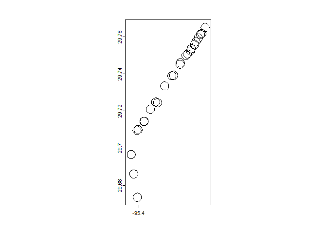

# README


## Research Question

Which demographic groups are impacted by light rail openings in the
United States.

## Research Context

- Houston, Texas

  - Red Line Light Rail

- Timeline: 2000-2008

- Hypothesis: Light rail openings increase pollution around stations

  - Reasoning: Light rail stations aggregate commuters throughout
    Houston, resulting in a concentration of pollution around these
    stations.

  - Confounding Factors

    - Power Plants: Houston has several power plants that produce PM2.5

    - Roads/Highways/Intersections: Houston has some of the most
      congested roads in the U.S.

    - Meteorological Factors

- Include table of confounding factors

- Include table or map of stations

-   

``` r
library("knitr")
```

    Warning: package 'knitr' was built under R version 4.3.3

``` r
t <- read.csv('Houston Data Collection - Charlotte.csv')
kable(t)
```

| Station                                           | Opening.Dates   | Address                                     | Coordinate | Parking |
|:--------------------------------------------------|:----------------|:--------------------------------------------|:-----------|:--------|
| UH-Downtown                                       | 1/1/2004        | 6 N Main St, Houston, TX 77002              | NA         | FALSE   |
| Preston Northbound                                | 1/1/2004        | 367 Main St, Houston, TX 77002              | NA         | FALSE   |
| Preston Southbound                                | 1/1/2004        | 414 Main St, Houston, TX 77002              | NA         | FALSE   |
| Central Station Main                              | 2/18/2015       | 714 Main St, Houston, TX 77002              | NA         | FALSE   |
| Main Street Square Northbound                     | 1/1/2004        | 960 Main St, Houston, TX 77002              | NA         | FALSE   |
| Main Street Square Southbound                     | 1/1/2004        | 1131 Main St, Houston, TX 77002             | NA         | FALSE   |
| Bell Northbound                                   | January 1, 2004 | 1453 Main St., Houston, TX 77002            | NA         | FALSE   |
| Bell Southbound                                   | January 1, 2004 | 1523 Main St., Houston, TX 77002            | NA         | FALSE   |
| Downtown Transit Center Northbound                | 1/1/2004        | 1840 Main St., Houston, TX 77002            | NA         | FALSE   |
| Downtown Transit Center Southbound                | 1/1/2004        | 1914 Main St., Houston, TX 77002            | NA         | FALSE   |
| McGowen Northbound                                | 1/1/2004        | 2560 Main St., Houston, TX 77002            | NA         | FALSE   |
| McGowen Southbound                                | 1/1/2004        | 2606 Main St., Houston, TX 77002            | NA         | FALSE   |
| Ensemble / HCC Northbound                         | 1/1/2004        | 3509 Main St., Houston, TX 77002            | NA         | FALSE   |
| Ensemble / HCC Southbound                         | 1/1/2004        | 3604 Main St., Houston, TX 77002            | NA         | FALSE   |
| Wheeler                                           | 1/1/2004        | 4590 Main St., Houston, TX 77002            | NA         | FALSE   |
| Museum District Northbound                        | 1/1/2004        | 5640 San Jacinto St, Houston, TX 77004      | NA         | FALSE   |
| Museum District Southbound                        | 1/1/2004        | 5660 Fannin St., Houston, TX 77004          | NA         | FALSE   |
| Hermann Park / Rice U                             | 1/1/2004        | 6050 Fannin St., Houston, TX 77030          | NA         | FALSE   |
| Memorial Hermann Hospital /Houston Zoo Northbound | 1/1/2004        | 6413 Fannin St., Houston, TX 77030          | NA         | FALSE   |
| Memorial Hermann Hospital /Houston Zoo Southbound | 1/1/2004        | 6407 Fannin St., Houston, TX 77030          | NA         | FALSE   |
| Dryden/TMC Northbound                             | 1/1/2004        | 6607 Fannin St., Houston, TX 77021          | NA         | FALSE   |
| Dryden/TMC Southbound                             | 1/1/2004        | 6614 Fannin St., Houston, TX 77030          | NA         | FALSE   |
| TMC Transit Center                                | 1/1/2004        | 5640 San Jacinto St., Houston, TX 77004Will | NA         | FALSE   |
| Smith Lands                                       | 1/1/2004        | 7834 Greenbriar Drive, Houston, TX 77054    | NA         | FALSE   |
| Stadium Park / Astrodome                          | 1/1/2004        | 8168 Fannin St., Houston, TX 77054          | NA         | FALSE   |
| Fannin South                                      | 1/1/2004        | 1604 West Bellfort Ave., Houston, TX 77054  | NA         | TRUE    |

``` r
library("terra")
```

    Warning: package 'terra' was built under R version 4.3.3

    terra 1.7.78


    Attaching package: 'terra'

    The following object is masked from 'package:knitr':

        spin

``` r
sta<-vect("buff_sta.shp")

plot(sta)
```


