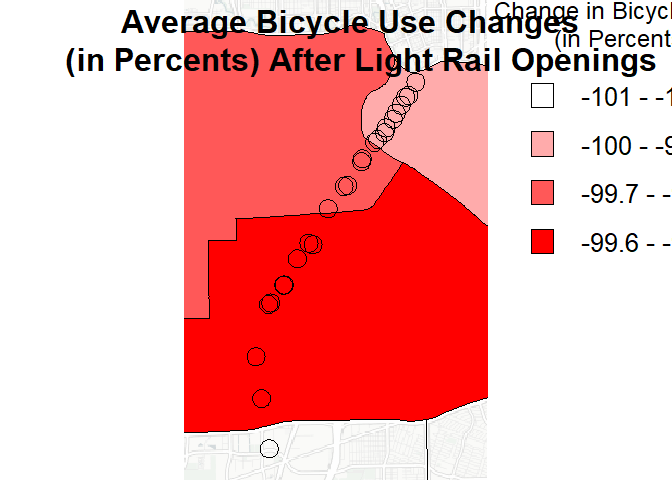
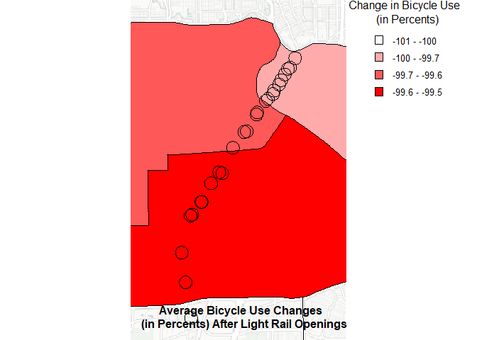
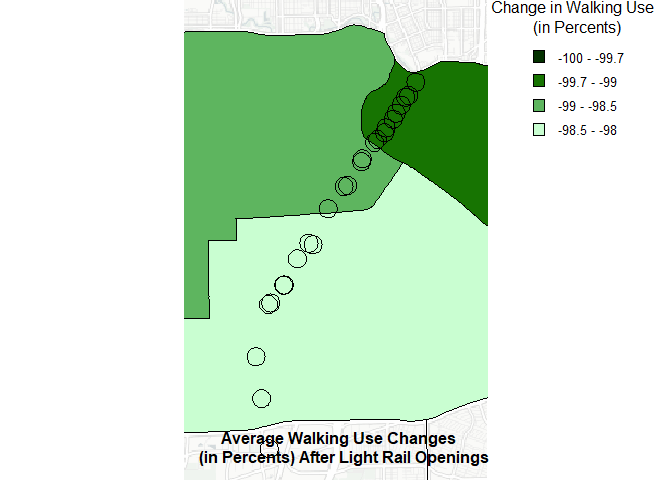
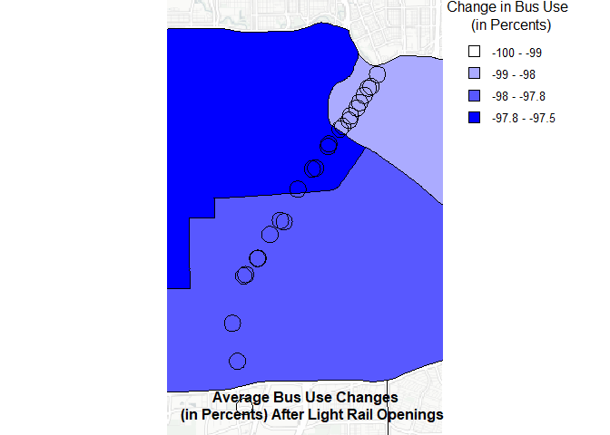
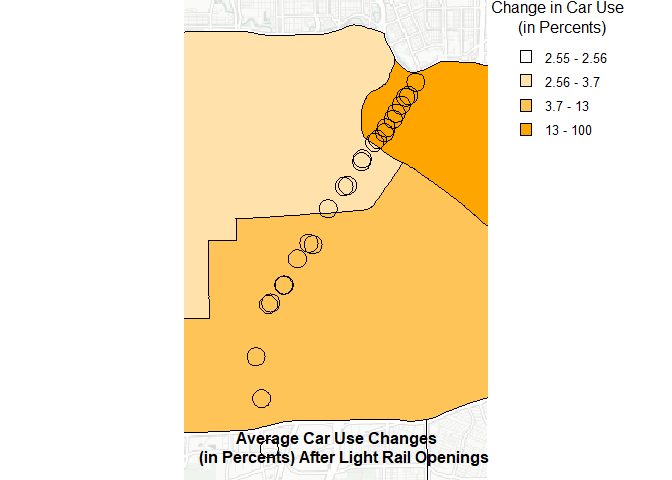

# README


## Research Question

How does the opening of Houston’s Red Line Light Rail correlate to
changes in transportation choice and PM2.5 pollution?

## Research Context

- Houston, Texas

  - Red Line Light Rail

- Timeline: 2000-2008

  - The Red Line opened in 2004.

- Hypothesis: Light rail openings increase pollution around stations,

  - Reasoning: Light rail stations aggregate commuters throughout
    Houston, resulting in a concentration of pollution around these
    stations.

- Confounding Factors

  - Power Plants: Houston has several power plants that produce PM2.5

    - The primary pollutant along the Red Line is the UH Central Power
      Station

  - Roads/Highways/Intersections: Houston has some of the most congested
    roads in the U.S.

  - Meteorological Factors: Various weather and climate influences on
    PM2.5 levels

    - Temperature

    - Wind

    - Humidity

  - Policies

    - NAAQS

    - TERP: Texas Emission Reduction Plan

### Power Plants

We used a Google API key to identify the coordinates for all power
plants and stations along the Red Line.

- Three main polluters along the Red Line

  - UH Central Power Station: Primary polluter and provides energy to
    the University of Houston.

  - Friendswood Energy Center: Supports the reliability of the local
    grid by generating energy during power fluctuations.

  - Houston Holmes Ready-Mix Concrete Plant: A cement mixing plant that
    pollutes particulate matter.

``` r
library('knitr')
library('tidyverse')
t <- read.csv('Untitled spreadsheet - Sheet1.csv')
kable(t)
```

| Name                            | Address                                         | Coords |
|:--------------------------------|:------------------------------------------------|:-------|
| UH Central Power Plant          | 4738 Calhoun Rd, Houston, TX 77004              | NA     |
| NRG T.H. Wharton Plant          | 16301 Texas 249 Access Rd, Houston, TX 77064    | NA     |
| Friendswood Energy Center       | 12100 Hiram Clarke Rd bldg-d, Houston, TX 77045 | NA     |
| W.A. Parish Generating Station  | 2500 Y. U. Jones Rd, Richmond, TX 77469         | NA     |
| EIF Channelview Cogeneration    | 8580 Sheldon Rd, Houston, TX 77049              | NA     |
| Smith Power Systems             | 256 N Sam Houston Pkwy E, Houston, TX 77060     | NA     |
| Calpine Deer Park Energy Center | 5665 Hwy 225, Deer Park, TX 77536               | NA     |

### Red Line Stations

Below is a table of the 26 stations on Houston’s Red Line

``` r
t <- read.csv('Houston Data Collection.csv')
t <- t %>%
  select(Station, Opening.Dates, Address, Parking)
kable(t)
```

| Station                                           | Opening.Dates | Address                                     | Parking |
|:--------------------------------------------------|:--------------|:--------------------------------------------|:--------|
| UH-Downtown                                       | 1/1/2004      | 6 N Main St, Houston, TX 77002              | FALSE   |
| Preston Northbound                                | 1/1/2004      | 367 Main St, Houston, TX 77002              | FALSE   |
| Preston Southbound                                | 1/1/2004      | 414 Main St, Houston, TX 77002              | FALSE   |
| Central Station Main                              | 2/18/2015     | 714 Main St, Houston, TX 77002              | FALSE   |
| Main Street Square Northbound                     | 1/1/2004      | 960 Main St, Houston, TX 77002              | FALSE   |
| Main Street Square Southbound                     | 1/1/2004      | 1131 Main St, Houston, TX 77002             | FALSE   |
| Bell Northbound                                   | 1/1/2004      | 1453 Main St., Houston, TX 77002            | FALSE   |
| Bell Southbound                                   | 1/1/2004      | 1523 Main St., Houston, TX 77002            | FALSE   |
| Downtown Transit Center Northbound                | 1/1/2004      | 1840 Main St., Houston, TX 77002            | FALSE   |
| Downtown Transit Center Southbound                | 1/1/2004      | 1914 Main St., Houston, TX 77002            | FALSE   |
| McGowen Northbound                                | 1/1/2004      | 2560 Main St., Houston, TX 77002            | FALSE   |
| McGowen Southbound                                | 1/1/2004      | 2606 Main St., Houston, TX 77002            | FALSE   |
| Ensemble / HCC Northbound                         | 1/1/2004      | 3509 Main St., Houston, TX 77002            | FALSE   |
| Ensemble / HCC Southbound                         | 1/1/2004      | 3604 Main St., Houston, TX 77002            | FALSE   |
| Wheeler                                           | 1/1/2004      | 4590 Main St., Houston, TX 77002            | FALSE   |
| Museum District Northbound                        | 1/1/2004      | 5640 San Jacinto St, Houston, TX 77004      | FALSE   |
| Museum District Southbound                        | 1/1/2004      | 5660 Fannin St., Houston, TX 77004          | FALSE   |
| Hermann Park / Rice U                             | 1/1/2004      | 6050 Fannin St., Houston, TX 77030          | FALSE   |
| Memorial Hermann Hospital /Houston Zoo Northbound | 1/1/2004      | 6413 Fannin St., Houston, TX 77030          | FALSE   |
| Memorial Hermann Hospital /Houston Zoo Southbound | 1/1/2004      | 6407 Fannin St., Houston, TX 77030          | FALSE   |
| Dryden/TMC Northbound                             | 1/1/2004      | 6607 Fannin St., Houston, TX 77021          | FALSE   |
| Dryden/TMC Southbound                             | 1/1/2004      | 6614 Fannin St., Houston, TX 77030          | FALSE   |
| TMC Transit Center                                | 1/1/2004      | 5640 San Jacinto St., Houston, TX 77004Will | FALSE   |
| Smith Lands                                       | 1/1/2004      | 7834 Greenbriar Drive, Houston, TX 77054    | FALSE   |
| Stadium Park / Astrodome                          | 1/1/2004      | 8168 Fannin St., Houston, TX 77054          | FALSE   |
| Fannin South                                      | 1/1/2004      | 1604 West Bellfort Ave., Houston, TX 77054  | TRUE    |

### Map of Houston

- Red Line Stations: Black Points

- Buffers: Red Circles

  - Radius: 125 m

- Highways: Yellow Lines

- Power Plants: Blue Points

``` r
library('terra')
library('maptiles')

x <- vect('bg_x_vect.shp')
buff_sta <- vect('buff_sta.shp')
sta_pts <- vect('sta_pts.shp')
pow_pla_pts <- vect('pow_pla_pts.shp')
tsp <- vect('tsp.shp')

extent <- buffer(x, width = 10000)
bg <- get_tiles(ext(extent))


plot(bg)
points(sta_pts)
points(pow_pla_pts, col = 'blue')
lines(buff_sta, col = 'red')
lines(tsp, col = "yellow", lwd = 2)
```


## Linear Regression Model for PM2.5

We gathered PM2.5 data from NASA’s Socioeconomic Data and Application
Center. We combined the PM2.5 data with meteorological data from NASA’s
Global Land Data Assimilation System used use and DB-OLS model to
identify connections. The regression model includes the relevant
policies NAAQS and Texas Emissions Reduction Policy (TERP) which
occurred during the time of our study. The model also includes the
influence of metro stations opening with the MetroOpen variable and the
influence of construction with the construction variable. Additionally
we include time trend variables to account for continuous confounding
factors. The model also includes the use of two dummy variables for
construction and holiday days. By isolating these factors, the model
serves to predict PM2.5 levels by each factor with a key focus on the
influence of the MetroOpen variable.

``` r
df <- read.csv('stations_data.csv')
df2 <- df %>%
  mutate(date = as.Date(as.character(date_parse), format = '%Y%m%d'))

startDate <- as.Date('2000-1-1', format = '%Y-%m-%d')
endDate <- as.Date('2008-12-31', format = '%Y-%m-%d')
openDate <- as.Date('2004-1-1', format = '%Y-%m-%d')
consDate <- as.Date('2001-3-13', format = '%Y-%m-%d')

TERPstart <- as.Date('2001-11-14', format = '%Y-%m-%d')
TERPinactive <- as.Date('2002-2-1', format = '%Y-%m-%d')
TERPreactive <- as.Date('2003-6-26', format = '%Y-%m-%d')

NAAQS <- as.Date('2006-10-17', format = '%Y-%m-%d')

df3 <- df2 %>%
  filter(date >=startDate & date <= endDate) %>%
  mutate(MetroOpen = ifelse(date >= openDate,1,0)) %>%
  mutate(dow = wday(date))%>%
  mutate(construction = ifelse(date>consDate & date < openDate, 1 , 0)) %>%
  group_by(city_num)%>%
  rename(pm25 = pm25.y)%>%
  arrange(city_num, date)%>%
  mutate(lpm25 = lag(pm25)) %>%
  mutate(lpm25_2 = lpm25^2, lpm25_3 = lpm25^3, lpm25_4= lpm25^4)%>%
  mutate(t = as.numeric(date - startDate)) %>%
  mutate(t2 = t^2, t3 = t^3, t4 = t^4)%>%
  mutate(temp = Tair_f_tavg)%>%
  mutate(lag_temp = lag(Tair_f_tavg))%>%
  mutate(lag_temp_2 = lag_temp^2, 
         lag_temp_3 = lag_temp^3, 
         lag_temp_4 = lag_temp^4) %>%
  mutate(wind = Wind_f_tavg)%>%
  mutate(lag_wind = lag(Wind_f_tavg))%>%
  mutate(lag_wind_2 = lag_wind^2, 
         lag_wind_3 = lag_wind^3, 
         lag_wind_4 = lag_wind^4)%>%
  mutate(humidity = Qair_f_tavg)%>%
  mutate(lag_humidity = lag(Qair_f_tavg))%>%
  mutate(lag_humidity_2 = lag_humidity^2, 
         lag_humidity_3 = lag_humidity^3, 
         lag_humidity_4 = lag_humidity^4)%>%
  mutate(TERP = ifelse(date > TERPstart & 
                         date < TERPinactive | date > TERPreactive,1,0)) %>%
  mutate(NAAQS = ifelse(date>NAAQS,1,0))
```

The DB-OLS regression results are shown below.

``` r
summary(m2 <- lm(log(pm25) ~ MetroOpen + construction + as.factor(dow)
                 , data = df3))
```


    Call:
    lm(formula = log(pm25) ~ MetroOpen + construction + as.factor(dow), 
        data = df3)

    Residuals:
        Min      1Q  Median      3Q     Max 
    -1.9416 -0.2815  0.0120  0.2921  1.7743 

    Coefficients:
                    Estimate Std. Error t value Pr(>|t|)    
    (Intercept)     2.508861   0.005434  461.69   <2e-16 ***
    MetroOpen       0.120439   0.004514   26.68   <2e-16 ***
    construction    0.162385   0.004839   33.55   <2e-16 ***
    as.factor(dow)2 0.078168   0.005543   14.10   <2e-16 ***
    as.factor(dow)3 0.102183   0.005543   18.43   <2e-16 ***
    as.factor(dow)4 0.116146   0.005543   20.95   <2e-16 ***
    as.factor(dow)5 0.099082   0.005546   17.86   <2e-16 ***
    as.factor(dow)6 0.123908   0.005546   22.34   <2e-16 ***
    as.factor(dow)7 0.070688   0.005543   12.75   <2e-16 ***
    ---
    Signif. codes:  0 '***' 0.001 '**' 0.01 '*' 0.05 '.' 0.1 ' ' 1

    Residual standard error: 0.4321 on 84959 degrees of freedom
    Multiple R-squared:  0.02091,   Adjusted R-squared:  0.02082 
    F-statistic: 226.8 on 8 and 84959 DF,  p-value: < 2.2e-16

``` r
summary(m3 <- lm(log(pm25) ~ MetroOpen + construction + TERP + NAAQS +
                   temp + lag_temp + lag_temp_2 + lag_temp_3 + lag_temp_4 + 
                   wind + lag_wind + lag_wind_2 + lag_wind_3 + lag_wind_4 + 
                   humidity + lag_humidity + lag_humidity_2 + lag_humidity_3 +
                   lag_humidity_4 + 
                   as.factor(month) + as.factor(dow) + holiday + 
                   t + t2 + t3 + t4, data = df3))
```


    Call:
    lm(formula = log(pm25) ~ MetroOpen + construction + TERP + NAAQS + 
        temp + lag_temp + lag_temp_2 + lag_temp_3 + lag_temp_4 + 
        wind + lag_wind + lag_wind_2 + lag_wind_3 + lag_wind_4 + 
        humidity + lag_humidity + lag_humidity_2 + lag_humidity_3 + 
        lag_humidity_4 + as.factor(month) + as.factor(dow) + holiday + 
        t + t2 + t3 + t4, data = df3)

    Residuals:
         Min       1Q   Median       3Q      Max 
    -1.74642 -0.26267  0.00285  0.26629  1.62434 

    Coefficients:
                         Estimate Std. Error t value Pr(>|t|)    
    (Intercept)        -1.728e+04  4.336e+03  -3.986 6.72e-05 ***
    MetroOpen          -2.874e-01  1.271e-02 -22.603  < 2e-16 ***
    construction       -1.112e-01  9.765e-03 -11.392  < 2e-16 ***
    TERP               -1.783e-01  6.382e-03 -27.943  < 2e-16 ***
    NAAQS              -5.426e-02  8.232e-03  -6.591 4.40e-11 ***
    temp                3.172e-02  1.124e-03  28.232  < 2e-16 ***
    lag_temp            2.389e+02  5.977e+01   3.998 6.39e-05 ***
    lag_temp_2         -1.238e+00  3.089e-01  -4.008 6.13e-05 ***
    lag_temp_3          2.848e-03  7.092e-04   4.015 5.94e-05 ***
    lag_temp_4         -2.455e-06  6.105e-07  -4.020 5.81e-05 ***
    wind               -9.691e-02  1.395e-03 -69.483  < 2e-16 ***
    lag_wind           -2.006e-01  5.501e-02  -3.646 0.000267 ***
    lag_wind_2          1.998e-02  1.985e-02   1.007 0.314061    
    lag_wind_3          2.783e-03  2.977e-03   0.935 0.349934    
    lag_wind_4         -4.065e-04  1.577e-04  -2.577 0.009965 ** 
    humidity           -1.387e+01  1.266e+00 -10.949  < 2e-16 ***
    lag_humidity       -1.838e+02  2.690e+01  -6.831 8.46e-12 ***
    lag_humidity_2      2.710e+04  3.433e+03   7.893 3.00e-15 ***
    lag_humidity_3     -1.592e+06  1.832e+05  -8.691  < 2e-16 ***
    lag_humidity_4      3.156e+07  3.480e+06   9.070  < 2e-16 ***
    as.factor(month)2   1.026e-02  6.875e-03   1.492 0.135800    
    as.factor(month)3  -2.627e-02  7.619e-03  -3.447 0.000566 ***
    as.factor(month)4  -2.387e-02  9.306e-03  -2.565 0.010309 *  
    as.factor(month)5  -9.521e-03  1.123e-02  -0.848 0.396715    
    as.factor(month)6  -2.000e-01  1.297e-02 -15.427  < 2e-16 ***
    as.factor(month)7  -1.732e-01  1.361e-02 -12.725  < 2e-16 ***
    as.factor(month)8  -2.066e-01  1.390e-02 -14.871  < 2e-16 ***
    as.factor(month)9  -1.512e-01  1.227e-02 -12.323  < 2e-16 ***
    as.factor(month)10 -1.845e-01  9.909e-03 -18.618  < 2e-16 ***
    as.factor(month)11 -8.425e-02  7.634e-03 -11.036  < 2e-16 ***
    as.factor(month)12 -5.381e-02  6.684e-03  -8.052 8.27e-16 ***
    as.factor(dow)2     8.600e-02  5.102e-03  16.856  < 2e-16 ***
    as.factor(dow)3     1.052e-01  5.038e-03  20.881  < 2e-16 ***
    as.factor(dow)4     1.023e-01  5.047e-03  20.269  < 2e-16 ***
    as.factor(dow)5     9.726e-02  5.044e-03  19.282  < 2e-16 ***
    as.factor(dow)6     1.244e-01  5.042e-03  24.682  < 2e-16 ***
    as.factor(dow)7     5.511e-02  5.045e-03  10.925  < 2e-16 ***
    holidayTRUE        -1.019e-01  7.819e-03 -13.028  < 2e-16 ***
    t                  -1.966e-05  4.602e-05  -0.427 0.669170    
    t2                  7.262e-07  5.046e-08  14.391  < 2e-16 ***
    t3                 -3.897e-10  2.133e-11 -18.265  < 2e-16 ***
    t4                  5.718e-14  3.024e-15  18.909  < 2e-16 ***
    ---
    Signif. codes:  0 '***' 0.001 '**' 0.01 '*' 0.05 '.' 0.1 ' ' 1

    Residual standard error: 0.3924 on 84900 degrees of freedom
      (26 observations deleted due to missingness)
    Multiple R-squared:  0.1929,    Adjusted R-squared:  0.1925 
    F-statistic: 494.9 on 41 and 84900 DF,  p-value: < 2.2e-16

## Spatial Data Mapping

### PM2.5 Data by PUMA

We identify pollution reductions per station by organizing stations into
the PUMAs they reside in and identify the PM2.5 reduction by PUMAs.
PUMAs are Public Use Microdata Areas provided by the U.S. census. Here
we use PUMAS 4602, 4603, and 4604. We identify the pollution reduction
by PUMA by creating a new linear regression model including the
MetroOpen:as.factor(PUMACE10) as a variable.

``` r
mPM2.5 <- read.csv('PM2.5PollutionByPumaRegressionModel.csv')
```

``` r
buff<-vect("buff_sta.shp") #stations shapefile

shape<-tigris::pumas(state="TX",class="sp", year=2012)
shapevect<-vect(shape) 
shapevect$pumnum<-as.numeric(shapevect$PUMACE10)
shapevect<-subset(shapevect, shapevect$pumnum>4600 & shapevect$pumnum<=4604)

output<-c()

for(i in 0:24){
  buff2 <-subset(buff, buff$FID ==i)
  int<-crop(shapevect, buff2)
  intdf<-as.data.frame(int) %>%
    mutate(city_num=i+1) %>%
    mutate(intarea=expanse(int, unit="m"))
    
  output<-rbind(output, intdf)
}

output2<-output %>%
  group_by(city_num) %>%
  mutate(maxarea=max(intarea)) %>%
  filter(intarea==maxarea) %>%
  select(PUMACE10, city_num)

#run regressions with pum

df3 <- read.csv('regression_analysis_data') 
df4<-merge(df3, output2, by="city_num")

summary(m1 <- lm(log(pm25) ~ MetroOpen:as.factor(PUMACE10) + construction + 
                   TERP + NAAQS +
                   temp + lag_temp + lag_temp_2 + lag_temp_3 + lag_temp_4 + 
                   wind + lag_wind + lag_wind_2 + lag_wind_3 + lag_wind_4 + 
                   humidity + lag_humidity + lag_humidity_2 + lag_humidity_3 +
                   lag_humidity_4 + 
                   as.factor(month) + as.factor(dow) + holiday + 
                   t + t2 + t3 + t4, data = df4))

coef<-coef(m1)[42:44]
PUMACE10<-c("04602", "04603", "04604")
coefdf<-as.data.frame(cbind(coef, PUMACE10))
```

``` r
shapevect <- vect('shapevect.shp')

buff3 <- vect('buff3.shp')
buff2 <- vect('Buff2.shp')

osmpos <- create_provider(name = "CARTO.POSITRON",
                          url = "https://{s}.basemaps.cartocdn.com/light_all/{z}/{x}/{y}.png",
                          sub = c("a", "b", "c", "d"),
                          citation = "© OpenStreetMap contributors © CARTO ")
bg <- get_tiles(ext(buff3),provider = osmpos, crop = TRUE)
plot(bg, alpha=0.05)
plot(shapevect, add=TRUE)
plot(buff2, 
     "coef",
     type="interval",
     breaks=c(-34,-33.42,-30,-29.95, -23.94),
     col=map.pal("inferno"),
     cex.main=1.125,
     main="Average PM2.5 Change \n at Each Light Rail Station",
     plg=list( 
       title = "Change in PM2.5 \n (in Percents)",
       title.cex = 1, 
       cex = 1),
     add=TRUE)
```



### Transportation by PUMA

We identify the change in method of commute transportation by separating
PUMA census data from the years 2004 and 2008 and tracking the
percentage change for each of the three PUMAS. We tracked the percentage
change in those who bike, walk, bus, or drive to work.

The table below shows the change in transportation mode of each PUMA.

``` r
pum_coef <- read.csv('pum_coef.csv', colClass=c("PUMACE10"="character")) %>%
  dplyr::select(-X, -coef, -change_subway, -change_motorcycle, -change_taxicab)

kable(pum_coef)
```

| PUMACE10 | change_car | change_bus | change_walked | change_worked_at_home | change_bicycle |
|:---------|-----------:|-----------:|--------------:|----------------------:|---------------:|
| 04602    |  13.050926 |  -98.00246 |     -99.10123 |            -0.9863223 |     -100.00000 |
| 04603    |   3.729549 |  -97.80773 |     -98.06669 |            -0.9558443 |      -99.58851 |
| 04604    |   2.563333 |  -97.56737 |     -98.65856 |            -0.9741331 |      -99.68437 |

``` r
pum_coef <- read.csv('pum_coef.csv', colClass=c("PUMACE10"="character"))

buff<-vect("buff_sta.shp")
shapevect<-vect('shapevect.shp')
shape_coef<-merge(shapevect, pum_coef, by="PUMACE10")

plot(bg, alpha=0.05)
plot(shapevect, add=TRUE)
plot(shape_coef,
     "change_bicycle",
     type="interval",
     breaks=c(-101,-100,-99.7,-99.5,-99.6),
     col=map.pal("reds"),
     plg=list( # parameters for drawing legend
       title = "Change in Bicycle Use \n (in Percents)",
       title.cex = 1, # Legend title size
       cex = 1),
     add=TRUE)
title("Average Bicycle Use Changes\n (in Percents) After Light Rail Openings", line = -20, adj=0.45,cex.main=1)

plot(buff, add=TRUE)
```



``` r
plot(bg, alpha=0.05)
plot(shapevect, add=TRUE)
plot(shape_coef,
     "change_walked",
     type="interval",
     breaks=c(-100, -99,-99.65,-98.5, -98),
     col=map.pal("grass"),
     plg=list( # parameters for drawing legend
       title = "Change in Walking Use \n (in Percents)",
       title.cex = 1, # Legend title size
       cex = 1),
     add=TRUE)
title("Average Walking Use Changes\n (in Percents) After Light Rail Openings", line = -20, adj=0.45,cex.main=1)
plot(buff, add=TRUE)
```



``` r
plot(bg, alpha=0.05)
plot(shapevect, add=TRUE)
plot(shape_coef, 
     "change_bus",
     type="interval",
     breaks=c(-100,-99,-98,-97.8,-97.5),
     col=map.pal("blues"),
     plg=list( # parameters for drawing legend
       title = "Change in Bus Use \n (in Percents)",
       title.cex = 1, # Legend title size
       cex = 1),
     add=TRUE)
title("Average Bus Use Changes\n (in Percents) After Light Rail Openings", line=-20, adj=0.45,cex.main=1)
plot(buff, add=TRUE)
```



``` r
plot(bg, alpha=0.05)
plot(shapevect, add=TRUE)
plot(shape_coef, 
     "change_car",
     type="interval",
     breaks=c(100,13,3.7,2.56,2.55),
     col=map.pal("oranges"),
     plg=list( # parameters for drawing legend
       title = "Change in Car Use \n (in Percents)",
       title.cex = 1, # Legend title size
       cex = 1),
     add=TRUE)
title("Average Car Use Changes\n (in Percents) After Light Rail Openings", line=-20, adj=0.45,cex.main=1)
plot(buff, add=TRUE)
```



## Conclusion

Light rail opening led to an average PM2.5 reduction of 12-29%. Areas
with the most increase in car use saw the least reduction. After the
2004 opening of the red line, the use of buses, biking, and walking
decreased between 98-100%, but car usage increased between 2-13%
Stations with increased car use correlated with weaker reductions in
PM2.5 levels compared to the overall reduction seen after the light rail
opening

## References

### Data References

- Di, Q., Y. Wei, A. Shtein, C. Hultquist, X. Xing, H. Amini, L. Shi, I.
  Kloog, R. Silvern, J. Kelly, M. B. Sabath, C. Choirat, P.
  Koutrakis, A. Lyapustin, Y. Wang, L. J. Mickley, and J. Schwartz.
  Daily and Annual PM2.5 Concentrations for the Contiguous United
  States, 1-km Grids, v1 (2000 - 2016). Palisades, New York: NASA
  Socioeconomic Data and Applications Center (SEDAC). Accessed
  07/16/2024, <https://doi.org/10.7927/0rvr-4538>.

- Di, Q., H. Amini, L. Shi, I. Kloog, R. Silvern, J. Kelly, M. B.
  Sabath, C. Choirat, P. Koutrakis, A. Lyapustin, Y. Wang, L. J.
  Mickley, and J. Schwartz. 2019. An Ensemble-based Model of PM2.5
  Concentration Across the Contiguous United States with High
  Spatiotemporal Resolution. Environment International 130: 104909.
  Accessed 07/16/2024, <https://doi.org/10.1016/j.envint.2019.104909>.

- Li, B., H. Beaudoing, and M. Rodell, NASA/GSFC/HSL (2020), GLDAS
  Catchment Land Surface Model L4 daily 0.25 x 0.25 degree GRACE-DA1
  V2.2, Greenbelt, Maryland, USA, Goddard Earth Sciences Data and
  Information Services Center (GES DISC), Accessed: 07/16/2024,
  [10.5067/TXBMLX370XX8](https://doi.org/10.5067/TXBMLX370XX8)

### Policy References

- Texas Commission on Environmental Quality. (2024, July 12). Texas
  Emissions Reduction Plan. Texas Commission on Environmental Quality.
  https://www.tceq.texas.gov/airquality/terp
