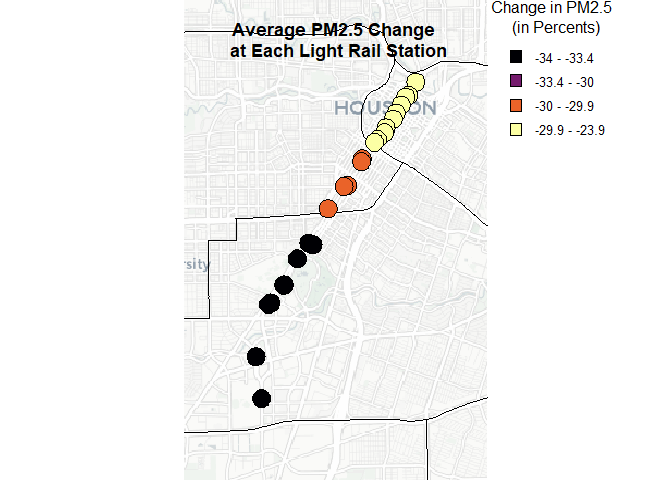

# README


## Research Question

Following Houston’s Red Line MetroRail opening, how did the means of
transportation parallel PM2.5 emissions surrounding stations?

## Research Context

- Houston, Texas

  - Red Line Light Rail

- Timeline: 2000-2008

  - The Red Line opened in 2004.

- Hypothesis: Light rail openings increase pollution around stations

  - Reasoning: Light rail stations aggregate commuters throughout
    Houston, resulting in a concentration of pollution around these
    stations.

  - Confounding Factors

    - Power Plants: Houston has several power plants that produce PM2.5.

      - The primary pollutant along the Red Line is the UH Central Power
        Station

    - Roads/Highways/Intersections: Houston has some of the most
      congested roads in the U.S.

    - Meteorological Factors: Various weather and climate influences on
      PM2.5 levels

      - Temperature

      - Wind

      - Humidity

### Power Plants

We used a Google API key to identify the coordinates for all power
plants and stations along the Red Line.

- Three main polluters along the Red Line

  - UH Central Power Station: Primary polluter and provides energy to
    the University of Houston.

  - Friendswood Energy Center: Supports the reliability of the local
    grid by generating energy during power fluctuations.

  - Houston Holmes Ready-Mix Concrete Plant: A cement mixing plant that
    pollutes particulate matter.

``` r
library('knitr')
```

    Warning: package 'knitr' was built under R version 4.3.3

``` r
#| message: false
library('tidyverse')
```

    Warning: package 'tidyverse' was built under R version 4.3.3

``` r
t <- read.csv('Untitled spreadsheet - Sheet1.csv')
kable(t)
```

| Name                            | Address                                         | Coords |
|:--------------------------------|:------------------------------------------------|:-------|
| UH Central Power Plant          | 4738 Calhoun Rd, Houston, TX 77004              | NA     |
| NRG T.H. Wharton Plant          | 16301 Texas 249 Access Rd, Houston, TX 77064    | NA     |
| Friendswood Energy Center       | 12100 Hiram Clarke Rd bldg-d, Houston, TX 77045 | NA     |
| W.A. Parish Generating Station  | 2500 Y. U. Jones Rd, Richmond, TX 77469         | NA     |
| EIF Channelview Cogeneration    | 8580 Sheldon Rd, Houston, TX 77049              | NA     |
| Smith Power Systems             | 256 N Sam Houston Pkwy E, Houston, TX 77060     | NA     |
| Calpine Deer Park Energy Center | 5665 Hwy 225, Deer Park, TX 77536               | NA     |

### Red Line Stations

Below is a table of the 26 stations on Houston’s Red Line

``` r
t <- read.csv('Houston Data Collection.csv')
t <- t %>%
  select(Station, Opening.Dates, Address, Parking)
kable(t)
```

| Station                                           | Opening.Dates | Address                                     | Parking |
|:--------------------------------------------------|:--------------|:--------------------------------------------|:--------|
| UH-Downtown                                       | 1/1/2004      | 6 N Main St, Houston, TX 77002              | FALSE   |
| Preston Northbound                                | 1/1/2004      | 367 Main St, Houston, TX 77002              | FALSE   |
| Preston Southbound                                | 1/1/2004      | 414 Main St, Houston, TX 77002              | FALSE   |
| Central Station Main                              | 2/18/2015     | 714 Main St, Houston, TX 77002              | FALSE   |
| Main Street Square Northbound                     | 1/1/2004      | 960 Main St, Houston, TX 77002              | FALSE   |
| Main Street Square Southbound                     | 1/1/2004      | 1131 Main St, Houston, TX 77002             | FALSE   |
| Bell Northbound                                   | 1/1/2004      | 1453 Main St., Houston, TX 77002            | FALSE   |
| Bell Southbound                                   | 1/1/2004      | 1523 Main St., Houston, TX 77002            | FALSE   |
| Downtown Transit Center Northbound                | 1/1/2004      | 1840 Main St., Houston, TX 77002            | FALSE   |
| Downtown Transit Center Southbound                | 1/1/2004      | 1914 Main St., Houston, TX 77002            | FALSE   |
| McGowen Northbound                                | 1/1/2004      | 2560 Main St., Houston, TX 77002            | FALSE   |
| McGowen Southbound                                | 1/1/2004      | 2606 Main St., Houston, TX 77002            | FALSE   |
| Ensemble / HCC Northbound                         | 1/1/2004      | 3509 Main St., Houston, TX 77002            | FALSE   |
| Ensemble / HCC Southbound                         | 1/1/2004      | 3604 Main St., Houston, TX 77002            | FALSE   |
| Wheeler                                           | 1/1/2004      | 4590 Main St., Houston, TX 77002            | FALSE   |
| Museum District Northbound                        | 1/1/2004      | 5640 San Jacinto St, Houston, TX 77004      | FALSE   |
| Museum District Southbound                        | 1/1/2004      | 5660 Fannin St., Houston, TX 77004          | FALSE   |
| Hermann Park / Rice U                             | 1/1/2004      | 6050 Fannin St., Houston, TX 77030          | FALSE   |
| Memorial Hermann Hospital /Houston Zoo Northbound | 1/1/2004      | 6413 Fannin St., Houston, TX 77030          | FALSE   |
| Memorial Hermann Hospital /Houston Zoo Southbound | 1/1/2004      | 6407 Fannin St., Houston, TX 77030          | FALSE   |
| Dryden/TMC Northbound                             | 1/1/2004      | 6607 Fannin St., Houston, TX 77021          | FALSE   |
| Dryden/TMC Southbound                             | 1/1/2004      | 6614 Fannin St., Houston, TX 77030          | FALSE   |
| TMC Transit Center                                | 1/1/2004      | 5640 San Jacinto St., Houston, TX 77004Will | FALSE   |
| Smith Lands                                       | 1/1/2004      | 7834 Greenbriar Drive, Houston, TX 77054    | FALSE   |
| Stadium Park / Astrodome                          | 1/1/2004      | 8168 Fannin St., Houston, TX 77054          | FALSE   |
| Fannin South                                      | 1/1/2004      | 1604 West Bellfort Ave., Houston, TX 77054  | TRUE    |

### Map of Houston

- Red Line Stations: Black Points

- Buffers: Red Circles

  - Radius: 125 m

- Highways: Yellow Lines

- Power Plants: Blue Points

``` r
library('terra')
library('maptiles')
library('ggmap')

x <- vect('bg_x_vect.shp')
buff_sta <- vect('buff_sta.shp')
sta_pts <- vect('sta_pts.shp')
pow_pla_pts <- vect('pow_pla_pts.shp')
tsp <- vect('tsp.shp')

extent <- buffer(x, width = 10000)
bg <- get_tiles(ext(extent))


plot(bg)
points(sta_pts)
points(pow_pla_pts, col = 'blue')
lines(buff_sta, col = 'red')
lines(tsp, col = "yellow", lwd = 2)
```


## Linear Regression Model for PM2.5

We gathered PM2.5 data from NASA’s Socioeconomic Data and Application
Center. We combined the PM2.5 data with meteorological data from NASA’s
Global Land Data Assimilation System used use and DB-OLS model to
identify connections. The regression model includes the relevant
policies NAAQS and Texas Emissions Reduction Policy (TERP) which
occurred during the time of our study. The model also includes the
influence of metro stations opening with the MetroOpen variable and the
influence of construction with the construction variable. Additionally
we include time trend variables to account for continuous confounding
factors. The model also includes the use of two dummy variables for
construction and holiday days. By isolating these factors, the model
serves to predict PM2.5 levels by each factor with a key focus on the
influence of the MetroOpen variable.

``` r
m <- read.csv('regression_model.csv')
m
```

        X               term      estimate    std.error   statistic       p.value
    1   1        (Intercept) -1.728364e+04 4.335717e+03  -3.9863398  6.715645e-05
    2   2          MetroOpen -2.873664e-01 1.271390e-02 -22.6025339 8.824241e-113
    3   3       construction -1.112408e-01 9.764917e-03 -11.3918838  4.826359e-30
    4   4               TERP -1.783369e-01 6.382279e-03 -27.9425116 4.862843e-171
    5   5              NAAQS -5.425625e-02 8.232035e-03  -6.5908673  4.398115e-11
    6   6               temp  3.172098e-02 1.123585e-03  28.2319258 1.529887e-174
    7   7           lag_temp  2.389477e+02 5.976766e+01   3.9979432  6.394926e-05
    8   8         lag_temp_2 -1.237950e+00 3.088745e-01  -4.0079388  6.130321e-05
    9   9         lag_temp_3  2.847831e-03 7.092352e-04   4.0153548  5.940740e-05
    10 10         lag_temp_4 -2.454570e-06 6.105229e-07  -4.0204396  5.813977e-05
    11 11               wind -9.690739e-02 1.394700e-03 -69.4826127  0.000000e+00
    12 12           lag_wind -2.005594e-01 5.501304e-02  -3.6456702  2.668550e-04
    13 13         lag_wind_2  1.998077e-02 1.984693e-02   1.0067435  3.140609e-01
    14 14         lag_wind_3  2.782947e-03 2.977300e-03   0.9347216  3.499344e-01
    15 15         lag_wind_4 -4.065162e-04 1.577418e-04  -2.5770991  9.965010e-03
    16 16           humidity -1.386630e+01 1.266402e+00 -10.9493680  6.985198e-28
    17 17       lag_humidity -1.837564e+02 2.689862e+01  -6.8314417  8.462917e-12
    18 18     lag_humidity_2  2.709702e+04 3.433238e+03   7.8925554  2.995706e-15
    19 19     lag_humidity_3 -1.592338e+06 1.832090e+05  -8.6913780  3.642943e-18
    20 20     lag_humidity_4  3.156415e+07 3.480072e+06   9.0699711  1.215016e-19
    21 21 as.factor(month)02  1.025522e-02 6.875174e-03   1.4916302  1.357998e-01
    22 22 as.factor(month)03 -2.626650e-02 7.619032e-03  -3.4474852  5.661055e-04
    23 23 as.factor(month)04 -2.387214e-02 9.305570e-03  -2.5653602  1.030858e-02
    24 24 as.factor(month)05 -9.520868e-03 1.123398e-02  -0.8475061  3.967155e-01
    25 25 as.factor(month)06 -2.000203e-01 1.296543e-02 -15.4272015  1.270658e-53
    26 26 as.factor(month)07 -1.731716e-01 1.360831e-02 -12.7254319  4.617874e-37
    27 27 as.factor(month)08 -2.066385e-01 1.389550e-02 -14.8708986  5.887471e-50
    28 28 as.factor(month)09 -1.512243e-01 1.227203e-02 -12.3226829  7.324430e-35
    29 29 as.factor(month)10 -1.844891e-01 9.908933e-03 -18.6184658  3.246327e-77
    30 30 as.factor(month)11 -8.425188e-02 7.633989e-03 -11.0364160  2.665689e-28
    31 31 as.factor(month)12 -5.381416e-02 6.683598e-03  -8.0516749  8.271644e-16
    32 32    as.factor(dow)2  8.600251e-02 5.102138e-03  16.8561723  1.200155e-63
    33 33    as.factor(dow)3  1.052052e-01 5.038276e-03  20.8811970  1.390314e-96
    34 34    as.factor(dow)4  1.023084e-01 5.047436e-03  20.2693896  3.942050e-91
    35 35    as.factor(dow)5  9.726118e-02 5.044109e-03  19.2821347  1.141142e-82
    36 36    as.factor(dow)6  1.244446e-01 5.041952e-03  24.6818258 4.991926e-134
    37 37    as.factor(dow)7  5.511228e-02 5.044618e-03  10.9249648  9.138635e-28
    38 38        holidayTRUE -1.018700e-01 7.819250e-03 -13.0281021  9.226716e-39
    39 39                  t -1.966327e-05 4.601863e-05  -0.4272894  6.691697e-01
    40 40                 t2  7.261783e-07 5.046115e-08  14.3908397  6.709424e-47
    41 41                 t3 -3.896620e-10 2.133349e-11 -18.2652753  2.173276e-74
    42 42                 t4  5.718178e-14 3.023975e-15  18.9094753  1.390127e-79

## Spatial Data Mapping

### PM2.5 Data by PUMA

We identify pollution reductions per station by organizing stations into
the PUMAs they reside in and identify the PM2.5 reduction by PUMAs.
PUMAs are Public Use Microdata Areas provided by the U.S. census. We
identify the pollution reduction by PUMA by creating a new linear
regression model including the MetroOpen:as.factor(PUMACE10) as a
variable.

``` r
mPM2.5 <- read.csv('PM2.5PollutionByPumaRegressionModel.csv')
mPM2.5
```

        X                               term      estimate    std.error   statistic
    1   1                        (Intercept) -1.723005e+04 4.404824e+03  -3.9116320
    2   2                       construction -1.134362e-01 9.920559e-03 -11.4344603
    3   3                               TERP -1.798481e-01 6.484005e-03 -27.7371846
    4   4                              NAAQS -5.245409e-02 8.363244e-03  -6.2719784
    5   5                               temp  3.190619e-02 1.141494e-03  27.9512549
    6   6                           lag_temp  2.381658e+02 6.072029e+01   3.9223422
    7   7                         lag_temp_2 -1.233710e+00 3.137976e-01  -3.9315458
    8   8                         lag_temp_3  2.837685e-03 7.205396e-04   3.9382782
    9   9                         lag_temp_4 -2.445528e-06 6.202539e-07  -3.9427855
    10 10                               wind -9.703620e-02 1.416930e-03 -68.4834131
    11 11                           lag_wind -2.022140e-01 5.588989e-02  -3.6180778
    12 12                         lag_wind_2  2.050768e-02 2.016327e-02   1.0170809
    13 13                         lag_wind_3  2.729397e-03 3.024755e-03   0.9023532
    14 14                         lag_wind_4 -4.050568e-04 1.602560e-04  -2.5275602
    15 15                           humidity -1.381986e+01 1.286587e+00 -10.7414860
    16 16                       lag_humidity -1.865525e+02 2.732736e+01  -6.8265848
    17 17                     lag_humidity_2  2.737541e+04 3.487960e+03   7.8485462
    18 18                     lag_humidity_3 -1.603056e+06 1.861291e+05  -8.6125997
    19 19                     lag_humidity_4  3.171332e+07 3.535541e+06   8.9698651
    20 20                  as.factor(month)2  9.048775e-03 6.984756e-03   1.2955034
    21 21                  as.factor(month)3 -2.784362e-02 7.740471e-03  -3.5971478
    22 22                  as.factor(month)4 -2.612697e-02 9.453890e-03  -2.7636210
    23 23                  as.factor(month)5 -1.213649e-02 1.141304e-02  -1.0633880
    24 24                  as.factor(month)6 -2.026952e-01 1.317209e-02 -15.3882382
    25 25                  as.factor(month)7 -1.750920e-01 1.382521e-02 -12.6646899
    26 26                  as.factor(month)8 -2.092155e-01 1.411698e-02 -14.8201383
    27 27                  as.factor(month)9 -1.543882e-01 1.246763e-02 -12.3831241
    28 28                 as.factor(month)10 -1.865986e-01 1.006687e-02 -18.5359124
    29 29                 as.factor(month)11 -8.582433e-02 7.755667e-03 -11.0660153
    30 30                 as.factor(month)12 -5.436059e-02 6.790127e-03  -8.0058286
    31 31                    as.factor(dow)2  8.662999e-02 5.183460e-03  16.7127738
    32 32                    as.factor(dow)3  1.061896e-01 5.118581e-03  20.7459028
    33 33                    as.factor(dow)4  1.032636e-01 5.127887e-03  20.1376479
    34 34                    as.factor(dow)5  9.811517e-02 5.124506e-03  19.1462675
    35 35                    as.factor(dow)6  1.251045e-01 5.122315e-03  24.4234379
    36 36                    as.factor(dow)7  5.547096e-02 5.125024e-03  10.8235524
    37 37                        holidayTRUE -1.028137e-01 7.943880e-03 -12.9425049
    38 38                                  t -9.989363e-06 4.675211e-05  -0.2136666
    39 39                                 t2  7.333835e-07 5.126544e-08  14.3056123
    40 40                                 t3 -3.974988e-10 2.167352e-11 -18.3403000
    41 41                                 t4  5.864857e-14 3.072174e-15  19.0902535
    42 42 MetroOpen:as.factor(PUMACE10)04602 -2.394733e-01 1.311149e-02 -18.2643784
    43 43 MetroOpen:as.factor(PUMACE10)04603 -3.342031e-01 1.311149e-02 -25.4893271
    44 44 MetroOpen:as.factor(PUMACE10)04604 -2.995036e-01 1.343011e-02 -22.3008995
             p.value
    1   9.174868e-05
    2   2.966186e-30
    3  1.514134e-168
    4   3.582674e-10
    5  4.097841e-171
    6   8.776402e-05
    7   8.447102e-05
    8   8.213654e-05
    9   8.060781e-05
    10  0.000000e+00
    11  2.969783e-04
    12  3.091180e-01
    13  3.668719e-01
    14  1.148768e-02
    15  6.773926e-27
    16  8.756475e-12
    17  4.259642e-15
    18  7.266788e-18
    19  3.029667e-19
    20  1.951503e-01
    21  3.219157e-04
    22  5.717670e-03
    23  2.876092e-01
    24  2.333431e-53
    25  1.004804e-36
    26  1.259801e-49
    27  3.469152e-35
    28  1.522974e-76
    29  1.921268e-28
    30  1.202133e-15
    31  1.345080e-62
    32  2.355691e-95
    33  5.719302e-90
    34  1.570766e-81
    35 2.862095e-131
    36  2.778694e-27
    37  2.825436e-38
    38  8.308076e-01
    39  2.297158e-46
    40  5.586467e-75
    41  4.574879e-81
    42  2.238334e-74
    43 9.403559e-143
    44 7.724047e-110

``` r
shapevect <- vect('shapevect.shp')
buff3 <- vect('buff3.shp')
buff2 <- vect('Buff2.shp')

osmpos <- create_provider(name = "CARTO.POSITRON",
                          url = "https://{s}.basemaps.cartocdn.com/light_all/{z}/{x}/{y}.png",
                          sub = c("a", "b", "c", "d"),
                          citation = "© OpenStreetMap contributors © CARTO ")
bg <- get_tiles(ext(buff3),provider = osmpos, crop = TRUE)
plot(bg, alpha=0.05)
plot(shapevect, add=TRUE)
plot(buff2, 
     "coef",
     type="interval",
     breaks=c(-34,-33.42,-30,-29.95, -23.94),
     col=map.pal("inferno"),
     cex.main=1.125,
     main="Average PM2.5 Change \n at Each Light Rail Station",
     plg=list( 
       title = "Change in PM2.5 \n (in Percents)",
       title.cex = 1, 
       cex = 1),
     add=TRUE)
```



### Transportation by PUMA

We identify the methods of transportation

## References

### Data References

- Di, Q., Y. Wei, A. Shtein, C. Hultquist, X. Xing, H. Amini, L. Shi, I.
  Kloog, R. Silvern, J. Kelly, M. B. Sabath, C. Choirat, P.
  Koutrakis, A. Lyapustin, Y. Wang, L. J. Mickley, and J. Schwartz.
  Daily and Annual PM2.5 Concentrations for the Contiguous United
  States, 1-km Grids, v1 (2000 - 2016). Palisades, New York: NASA
  Socioeconomic Data and Applications Center (SEDAC). Accessed
  07/16/2024, <https://doi.org/10.7927/0rvr-4538>.

- Di, Q., H. Amini, L. Shi, I. Kloog, R. Silvern, J. Kelly, M. B.
  Sabath, C. Choirat, P. Koutrakis, A. Lyapustin, Y. Wang, L. J.
  Mickley, and J. Schwartz. 2019. An Ensemble-based Model of PM2.5
  Concentration Across the Contiguous United States with High
  Spatiotemporal Resolution. Environment International 130: 104909.
  Accessed 07/16/2024, <https://doi.org/10.1016/j.envint.2019.104909>.

- Li, B., H. Beaudoing, and M. Rodell, NASA/GSFC/HSL (2020), GLDAS
  Catchment Land Surface Model L4 daily 0.25 x 0.25 degree GRACE-DA1
  V2.2, Greenbelt, Maryland, USA, Goddard Earth Sciences Data and
  Information Services Center (GES DISC), Accessed: 07/16/2024,
  [10.5067/TXBMLX370XX8](https://doi.org/10.5067/TXBMLX370XX8)

### Policy References

- 
